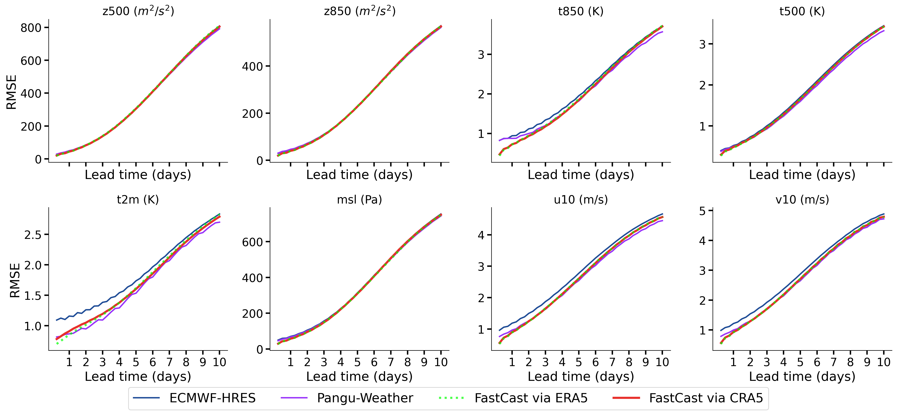
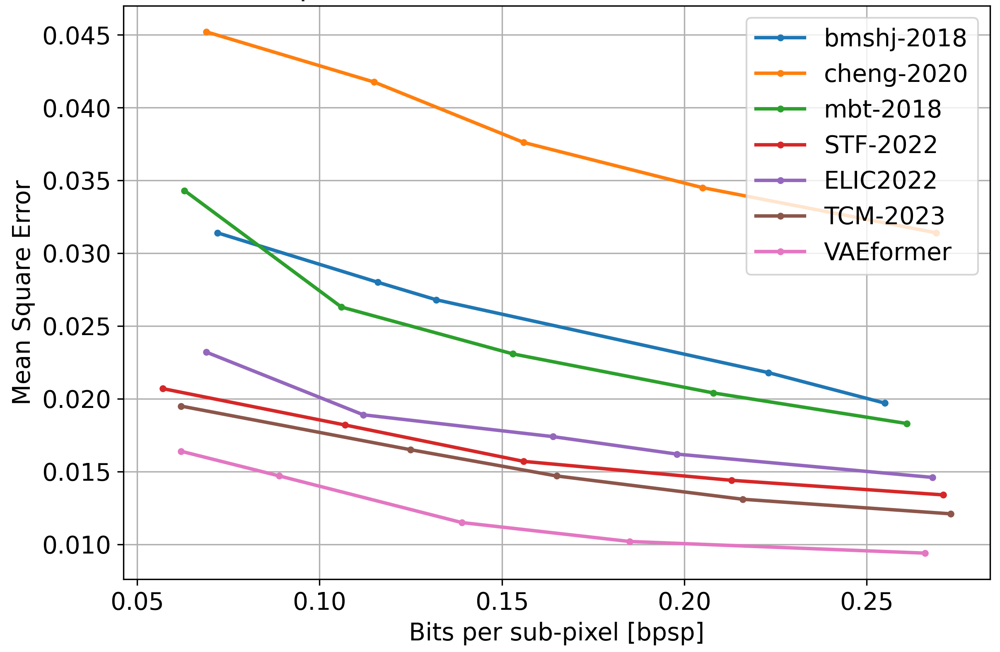
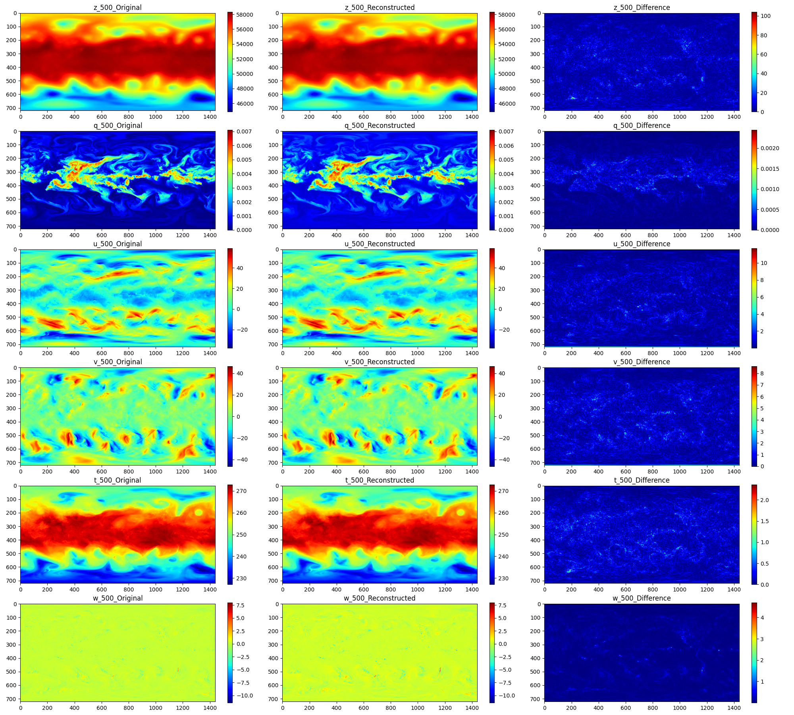
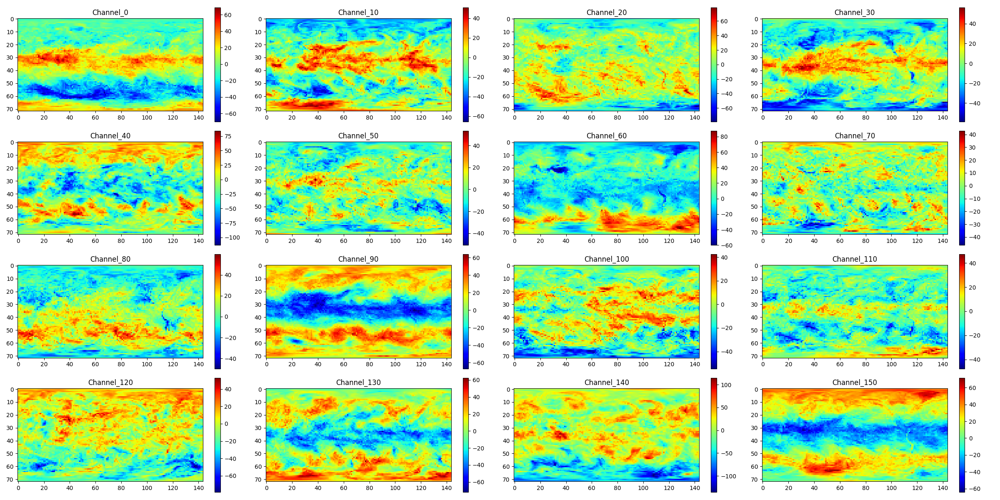

<!--  -->
<a href="url"></a>

[](https://github.com/InterDigitalInc/CompressAI/blob/master/LICENSE)
[](https://pypi.org/project/compressai/)
[](https://pypi.org/project/cra5/#files)

[Paper:CRA5: Extreme Compression of ERA5 for Portable Global Climate and Weather Research via an Efficient Variational Transformer](https://arxiv.org/abs/2405.03376)

# Introduction and get started
### CRA5 dataset now is available at [OneDrive](https://hkustconnect-my.sharepoint.com/:f:/g/personal/thanad_connect_ust_hk/EjGupNV_IcZKre1PdN65dFUB2sBOHX3MCH4cycBtcSm2yA?e=GAqS1J)
CRA5 is a extreme **compressed weather dataset** of the most popular ERA5 reanalysis dataset. The repository also includes **compression models**, **forecasting model** for researchers to conduct portable weather and climate research.

CRA5 currently provides:

* A customized variaitional transformer (VAEformer) for climate data compression
* A dataset CRA5 less than TiB, but contains the same information with 400+ TiB ERA5 dataset. Covering houly ERA5 from year 1979 to 2023.    
* A pre-trained Auto-Encoder on the climate/weather data to support some potential weather research.


> **Note**: Multi-GPU support is now experimental.

## Installation

CRA5 supports python 3.8+ and PyTorch 1.7+.
```
conda create --name cra5 python=3.10 -y 
conda activate cra5
```


**Please install cra5 from source**:

A C++17 compiler, a recent version of pip (19.0+), and common python packages are also required (see `setup.py` for the full list).

To get started locally and install the development version of CRA5, run the following commands in a [virtual environment](https://docs.python.org/3.6/library/venv.html):

```bash
git https://github.com/taohan10200/CRA5
cd CRA5
python setup.py install 
# or 
pip install -U pip && pip install -e .
```

For a custom installation, you can also run one of the following commands:
* `pip install -e '.[dev]'`: install the packages required for development (testing, linting, docs)
* `pip install -e '.[tutorials]'`: install the packages required for the tutorials (notebooks)
* `pip install -e '.[all]'`: install all the optional packages

> **Note**: Docker images will be released in the future. Conda environments are not
officially supported.

<!-- ## Documentation -->

<!-- * [Installation](https://interdigitalinc.github.io/CompressAI/installation.html)
* [CompressAI API](https://interdigitalinc.github.io/CompressAI/)
* [Training your own model](https://interdigitalinc.github.io/CompressAI/tutorials/tutorial_train.html)
* [List of available models (model zoo)](https://interdigitalinc.github.io/CompressAI/zoo.html) -->

# Usages

## 1. CRA5 dataset is an outcome of the VAEformer in the atmospheric science. We explore this to facilitate the research in weather and climate. 

* **Train the large data-driven numerical weather forecasting models with our CRA5**

> **Note**: For researches who do not have enough disk space to store the 300 TiB+ ERA5 dataset, but have interests to train a large weather forecasting model, like [FengWu-GHR](https://arxiv.org/abs/2402.00059),  this research can help you save it into less than 1 TiB disk.  

Our preliminary attemp has proven that the CRA5 dataset can train the very very similar NWP model compared with the original ERA5 dataset. Also, with this dataset, you can easily train a Nature published forecasting model, like [Pangu-Weather](https://www.nature.com/articles/s41586-023-06185-3). 

<!--  -->
<a href="url"></a>

## 2. VAEformer is a powerful compression model, we hope it can be extended to other domains, like image and video compression.

<!--  -->
<a href="url"></a>


*  **We here demonstrate how to use it for weather data compression and decompression**


```python
import os 
import torch
from cra5.models.compressai.zoo import vaeformer_pretrained
device = 'cuda' if torch.cuda.is_available() else 'cpu'
print(device)
net = vaeformer_pretrained(quality=268, pretrained=True).eval().to(device)
input_data_norm = torch.rand(1,268, 721,1440).to(device) #This is a proxy weather data. It actually should be a 

print(x.shape)
with torch.no_grad():
    out_net = net.compress(x) 
    
print(out_net)
```
or directly using our API


```python
from cra5.api import cra5_api
cra5_API = cra5_api()
# This command will download two ERA5 netcdf files 
# data/ERA5/2024/2024-06-01T00:00:00_pressure.nc (513MiB) and data/ERA5/2024/2024-06-01T00:00:00_single.nc (18MiB) 
# and then compress it into a tiny binary file `./data/cra5/2024/2024-06-01T00:00:00.bin` (**1.8Mib**)
cra5_API.encoder_era5(time_stamp="2024-06-01T00:00:00") 

# If you aready have the compressed binary file,  this command will help you get the reconstructed weather data.
cra5_data = cra5_API.decode_from_bin(time_stamp="2024-06-01T00:00:00")

# show some variables for the constructed data
cra5_API.show_image(
	reconstruct_data=cra5_data.cpu().numpy(), 
	time_stamp="2024-06-01T00:00:00", 
	show_variables=['z_500', 'q_500', 'u_500', 'v_500', 't_500', 'w_500'])

```
<!--  -->
<a href="url"></a>


## 3 VAEformer is based on the Auto-Encoder-Decoder, we provide a pretrained VAE for the weather research, you can use our VAEformer to get the latents for downstream research, like diffusion-based or other generation-based forecasting methods.

* **Using it as a Auto-Encoder-Decoder**

> **Note**: For people who are intersted in diffusion-based or other generation-based forecasting methods, we can provide an Auto Encoder and decoder for the weather research, you can use our VAEformer to get the latents for downstream research.


```python
# We build a downloader to help use download the original ERA5 netcdf files for testing.

# data/ERA5/2024/2024-06-01T00:00:00_pressure.nc (513MiB) and data/ERA5/2024/2024-06-01T00:00:00_single.nc (18MiB) 
from cra5.api.era5_downloader import era5_downloader
ERA5_data = era5_downloader('./cra5/api/era5_config.py') #specify the dataset config for what we want to download
data = ERA5_data.get_form_timestamp(time_stamp="2024-06-01T00:00:00",
                                    local_root='./data/ERA5')

# After getting the ERA5 data ready, you can explore the compression.
from cra5.api import cra5_api
cra5_API = cra5_api()

####=======================compression functions=====================
# Return a continuous latent y for ERA5 data at 2024-06-01T00:00:00
y = cra5_API.encode_to_latent(time_stamp="2024-06-01T00:00:00") 

# Return the the arithmetic coded binary stream of y 
bin_stream = cra5_API.latent_to_bin(y=y)  

# Or if you want to directly compress and save the binary stream to a folder
cra5_API.encode_era5_as_bin(time_stamp="2024-06-01T00:00:00", save_root='./data/cra5')  


####=======================decompression functions=====================
# Starting from the bin_stream, you can decode the binary file to the quantized latent.
y_hat = cra5_API.bin_to_latent(bin_path="./data/CRA5/2024/2024-06-01T00:00:00.bin")  # Decoding from binary can only get the quantized latent.

# Return the normalized cra5 data
normlized_x_hat = cra5_API.latent_to_reconstruction(y_hat=y_hat) 


# If you have saveed  or downloaded the binary file, then you can directly restore the binary file into reconstruction.
normlized_x_hat = cra5_API.decode_from_bin("2024-06-01T00:00:00", return_format='normalized') # Return the normalized cra5 data
x_hat = cra5_API.decode_from_bin("2024-06-01T00:00:00", return_format='de_normalized') # Return the de-normalized cra5 data

# show some variables for the constructed data
cra5_API.show_latent(
	latent=y_hat.squeeze(0).cpu().numpy(), 
	time_stamp="2024-06-01T00:00:00", 
	show_channels=[0, 10, 20, 30, 40, 50, 60, 70, 80, 90, 100, 110, 120, 130, 140, 150])

```
<!--  -->
<a href="url"></a>


<!-- Script and notebook examples can be found in the `examples/` directory.

To encode/decode images with the provided pre-trained models, run the
`codec.py` example:

```bash
python3 examples/codec.py --help
```

An examplary training script with a rate-distortion loss is provided in
`examples/train.py`. You can replace the model used in the training script
with your own model implemented within CompressAI, and then run the script for a
simple training pipeline:

```bash
python3 examples/train.py -d /path/to/my/image/dataset/ --epochs 300 -lr 1e-4 --batch-size 16 --cuda --save
```
> **Note:** the training example uses a custom [ImageFolder](https://interdigitalinc.github.io/CompressAI/datasets.html#imagefolder) structure.

A jupyter notebook illustrating the usage of a pre-trained model for learned image
compression is also provided in the `examples` directory:

```bash
pip install -U ipython jupyter ipywidgets matplotlib
jupyter notebook examples/
``` -->

<!-- ### Evaluation

To evaluate a trained model on your own dataset, CompressAI provides an
evaluation script:

```bash
python3 -m compressai.utils.eval_model checkpoint /path/to/images/folder/ -a $ARCH -p $MODEL_CHECKPOINT...
```

To evaluate provided pre-trained models:

```bash
python3 -m compressai.utils.eval_model pretrained /path/to/images/folder/ -a $ARCH -q $QUALITY_LEVELS...
```

To plot results from bench/eval_model simulations (requires matplotlib by default):

```bash
python3 -m compressai.utils.plot --help -->
<!-- ``` -->

<!-- To evaluate traditional codecs:

```bash
python3 -m compressai.utils.bench --help
python3 -m compressai.utils.bench bpg --help
python3 -m compressai.utils.bench vtm --help
```

For video, similar tests can be run, CompressAI only includes ssf2020 for now:

```bash
python3 -m compressai.utils.video.eval_model checkpoint /path/to/video/folder/ -a ssf2020 -p $MODEL_CHECKPOINT...
python3 -m compressai.utils.video.eval_model pretrained /path/to/video/folder/ -a ssf2020 -q $QUALITY_LEVELS...
python3 -m compressai.utils.video.bench x265 --help
python3 -m compressai.utils.video.bench VTM --help
python3 -m compressai.utils.video.plot --help
``` -->

<!-- ## Tests

Run tests with `pytest`:

```bash
pytest -sx --cov=compressai --cov-append --cov-report term-missing tests
```

Slow tests can be skipped with the `-m "not slow"` option. -->


## License

CompressAI is licensed under the BSD 3-Clause Clear License

## Contributing

We welcome feedback and contributions. Please open a GitHub issue to report
bugs, request enhancements or if you have any questions.

Before contributing, please read the CONTRIBUTING.md file.

## Authors

* Tao Han ([hantao10200@gmail.com](mailto:hantao10200@gmail.com)) 
* Zhenghao Chen.

## Citation

If you use this project, please cite the relevant original publications for the models and datasets, and cite this project as:

```
@article{han2024cra5extremecompressionera5,
      title={CRA5: Extreme Compression of ERA5 for Portable Global Climate and Weather Research via an Efficient Variational Transformer}, 
      author={Tao Han and Zhenghao Chen and Song Guo and Wanghan Xu and Lei Bai},
      year={2024},
      eprint={2405.03376},
      archivePrefix={arXiv},
      primaryClass={cs.LG},
      url={https://arxiv.org/abs/2405.03376}, 
}
```

For any work related to the forecasting models, please cite
```
@article{han2024fengwughr,
title={FengWu-GHR: Learning the Kilometer-scale Medium-range Global Weather Forecasting}, 
author={Tao Han and Song Guo and Fenghua Ling and Kang Chen and Junchao Gong and Jingjia Luo and Junxia Gu and Kan Dai and Wanli Ouyang and Lei Bai},
year={2024},
eprint={2402.00059},
archivePrefix={arXiv},
primaryClass={cs.LG}
}
```

## The weather variabls supported in CRA5 and their numerical error

CRA5 contains a total of 268 variables, including 7 pressure-level variables from the [ERA5 pressure level archive](https://cds.climate.copernicus.eu/cdsapp#!/dataset/reanalysis-era5-pressure-levels) and 9 [surface variables](https://cds.climate.copernicus.eu/cdsapp#!/dataset/reanalysis-era5-single-levels?tab=overview) . 

| Variable | channel | error   | Variable | channel | error   | Variable | channel | error   |Variable | channel  | error   |Variable | channel  | error   |  
|--------|---------|-----------|--------|---------|-----------|--------|---------|-----------|--------|---------|-----------|--------|---------|-----------|
| geopotential  | z_1000  | 9.386     | specific_humidity  | q_1000  | 0.00033   | u_component_of_wind | u_1000  | 0.416     |v_component_of_wind  | v_1000  | 0.411     | temperature  | t_1000  | 0.405     |
| geopotential  | z_975   | 7.857     | specific_humidity  | q_975   | 0.00032   | u_component_of_wind | u_975   | 0.448     |v_component_of_wind  | v_975   | 0.442     | temperature  | t_975   | 0.380     |
| geopotential  | z_950   | 6.802     | specific_humidity  | q_950   | 0.00035   | u_component_of_wind | u_950   | 0.491     |v_component_of_wind  | v_950   | 0.479     | temperature  | t_950   | 0.352     |
| geopotential  | z_925   | 6.088     | specific_humidity  | q_925   | 0.00037   | u_component_of_wind | u_925   | 0.520     |v_component_of_wind  | v_925   | 0.505     | temperature  | t_925   | 0.333     |
| geopotential  | z_900   | 5.575     | specific_humidity  | q_900   | 0.00036   | u_component_of_wind | u_900   | 0.518     |v_component_of_wind  | v_900   | 0.503     | temperature  | t_900   | 0.321     |
| geopotential  | z_875   | 5.259     | specific_humidity  | q_875   | 0.00035   | u_component_of_wind | u_875   | 0.517     |v_component_of_wind  | v_875   | 0.503     | temperature  | t_875   | 0.309     |
| geopotential  | z_850   | 5.061     | specific_humidity  | q_850   | 0.00034   | u_component_of_wind | u_850   | 0.508     |v_component_of_wind  | v_850   | 0.493     | temperature  | t_850   | 0.294     |
| geopotential  | z_825   | 4.941     | specific_humidity  | q_825   | 0.00031   | u_component_of_wind | u_825   | 0.496     |v_component_of_wind  | v_825   | 0.481     | temperature  | t_825   | 0.276     |
| geopotential  | z_800   | 4.897     | specific_humidity  | q_800   | 0.00029   | u_component_of_wind | u_800   | 0.487     |v_component_of_wind  | v_800   | 0.472     | temperature  | t_800   | 0.259     |
| geopotential  | z_775   | 4.947     | specific_humidity  | q_775   | 0.00027   | u_component_of_wind | u_775   | 0.486     |v_component_of_wind  | v_775   | 0.468     | temperature  | t_775   | 0.250     |
| geopotential  | z_750   | 5.120     | specific_humidity  | q_750   | 0.00029   | u_component_of_wind | u_750   | 0.545     |v_component_of_wind  | v_750   | 0.524     | temperature  | t_750   | 0.250     |
| geopotential  | z_700   | 5.593     | specific_humidity  | q_700   | 0.00029   | u_component_of_wind | u_700   | 0.638     |v_component_of_wind  | v_700   | 0.607     | temperature  | t_700   | 0.242     |
| geopotential  | z_650   | 5.810     | specific_humidity  | q_650   | 0.00025   | u_component_of_wind | u_650   | 0.634     |v_component_of_wind  | v_650   | 0.610     | temperature  | t_700   | 0.242     |
| geopotential  | z_600   | 5.882     | specific_humidity  | q_600   | 0.00020   | u_component_of_wind | u_600   | 0.633     |v_component_of_wind  | v_600   | 0.597     | temperature  | t_650   | 0.240     |
| geopotential  | z_550   | 5.958     | specific_humidity  | q_550   | 0.00018   | u_component_of_wind | u_550   | 0.668     |v_component_of_wind  | v_550   | 0.616     | temperature  | t_600   | 0.222     |
| geopotential  | z_500   | 6.098     | specific_humidity  | q_500   | 0.00014   | u_component_of_wind | u_500   | 0.676     |v_component_of_wind  | v_500   | 0.603     | temperature  | t_550   | 0.201     |
| geopotential  | z_450   | 6.408     | specific_humidity  | q_450   | 0.00010   | u_component_of_wind | u_450   | 0.699     |v_component_of_wind  | v_450   | 0.649     | temperature  | t_500   | 0.185     |
| geopotential  | z_400   | 6.851     | specific_humidity  | q_400   | 0.00007   | u_component_of_wind | u_400   | 0.733     |v_component_of_wind  | v_400   | 0.686     | temperature  | t_450   | 0.185     |
| geopotential  | z_350   | 7.366     | specific_humidity  | q_350   | 0.00004   | u_component_of_wind | u_350   | 0.760     |v_component_of_wind  | v_350   | 0.704     | temperature  | t_400   | 0.179     |
| geopotential  | z_300   | 8.324     | specific_humidity  | q_300   | 0.00002   | u_component_of_wind | u_300   | 0.744     |v_component_of_wind  | v_300   | 0.704     | temperature  | t_350   | 0.170     |
| geopotential  | z_250   | 8.100     | specific_humidity  | q_250   | 0.00001   | u_component_of_wind | u_250   | 0.765     |v_component_of_wind  | v_250   | 0.701     | temperature  | t_300   | 0.160     |
| geopotential  | z_225   | 7.698     | specific_humidity  | q_225   | 0.00001   | u_component_of_wind | u_225   | 0.722     |v_component_of_wind  | v_225   | 0.642     | temperature  | t_250   | 0.166     |
| geopotential  | z_200   | 7.900     | specific_humidity  | q_200   | 0.00000   | u_component_of_wind | u_200   | 0.646     |v_component_of_wind  | v_200   | 0.563     | temperature  | t_225   | 0.169     |
| geopotential  | z_175   | 8.059     | specific_humidity  | q_175   | 0.00000   | u_component_of_wind | u_175   | 0.565     |v_component_of_wind  | v_175   | 0.509     | temperature  | t_200   | 0.158     |
| geopotential  | z_150   | 8.928     | specific_humidity  | q_150   | 0.00000   | u_component_of_wind | u_150   | 0.525     |v_component_of_wind  | v_150   | 0.458     | temperature  | t_150   | 0.149     |
| geopotential  | z_125   | 10.813    | specific_humidity  | q_125   | 0.00000   | u_component_of_wind | u_125   | 0.479     |v_component_of_wind  | v_125   | 0.417     | temperature  | t_125   | 0.158     |
| geopotential  | z_100   | 15.956    | specific_humidity  | q_100   | 0.00000   | u_component_of_wind | u_100   | 0.447     |v_component_of_wind  | v_100   | 0.373     | temperature  | t_100   | 0.178     |
| geopotential  | z_70    | 11.158    | specific_humidity  | q_70    | 0.00000   | u_component_of_wind | u_70    | 0.360     |v_component_of_wind  | v_70    | 0.275     | temperature  | t_70    | 0.155     |
| geopotential  | z_50    | 11.962    | specific_humidity  | q_50    | 0.00000   | u_component_of_wind | u_50    | 0.356     |v_component_of_wind  | v_50    | 0.242     | temperature  | t_50    | 0.158     |
| geopotential  | z_30    | 13.317    | specific_humidity  | q_30    | 0.00000   | u_component_of_wind | u_30    | 0.348     |v_component_of_wind  | v_30    | 0.221     | temperature  | t_30    | 0.153     |
| geopotential  | z_20    | 16.538    | specific_humidity  | q_20    | 0.00000   | u_component_of_wind | u_20    | 0.361     |v_component_of_wind  | v_20    | 0.229     | temperature  | t_20    | 0.161     |
| geopotential  | z_10    | 19.751    | specific_humidity  | q_10    | 0.00000   | u_component_of_wind | u_10    | 0.350     |v_component_of_wind  | v_10    | 0.232     | temperature  | t_10    | 0.166     |
| geopotential  | z_7     | 20.925    | specific_humidity  | q_7     | 0.00000   | u_component_of_wind | u_7     | 0.315     |v_component_of_wind  | v_7     | 0.225     | temperature  | t_7     | 0.161     |
| geopotential  | z_5     | 20.825    | specific_humidity  | q_5     | 0.00000   | u_component_of_wind | u_5     | 0.307     |v_component_of_wind  | v_5     | 0.212     | temperature  | t_5     | 0.160     |
| geopotential  | z_3     | 24.529    | specific_humidity  | q_3     | 0.00000   | u_component_of_wind | u_3     | 0.333     |v_component_of_wind  | v_3     | 0.246     | temperature  | t_3     | 0.194     |
| geopotential  | z_2     | 28.055    | specific_humidity  | q_2     | 0.00000   | u_component_of_wind | u_2     | 0.338     |v_component_of_wind  | v_2     | 0.239     | temperature  | t_2     | 0.184     |
| geopotential  | z_1     | 27.987    | specific_humidity  | q_1     | 0.00000   | u_component_of_wind | u_1     | 0.363     |v_component_of_wind  | v_1     | 0.245     | temperature  | t_1     | 0.182     |
|--------|---------|-----------|--------|---------|-----------|--------|---------|-----------|--------|---------|-----------|--------|---------|-----------|
| relative_humidity | r_1000  | 3.073     | vertical_velocity  w_1000  | 0.059     || 10m_v_component_of_wind  | v10     | 0.367     |
| relative_humidity | r_975   | 3.192     | vertical_velocity  w_975   | 0.067     || 10m_u_component_of_wind  | u10     | 0.379     |
| relative_humidity | r_950   | 3.588     | vertical_velocity  w_950   | 0.078     || 100m_v_component_of_wind  | v100    | 0.435     |
| relative_humidity | r_925   | 3.877     | vertical_velocity  w_925   | 0.086     || 100m_u_component_of_wind  | u100    | 0.445     |
| relative_humidity | r_900   | 3.982     | vertical_velocity  w_900   | 0.090     || 2m_temperature  | t2m     | 0.720     |
| relative_humidity | r_875   | 4.011     | vertical_velocity  w_875   | 0.092     || total_cloud_cover  | tcc     | 0.146     |
| relative_humidity | r_850   | 3.933     | vertical_velocity  w_850   | 0.093     || surface_pressure  | sp      | 480.222   
| relative_humidity | r_825   | 3.789     | vertical_velocity  w_825   | 0.094     || total_precipitation  | tp1h    | 0.264     |
| relative_humidity | r_800   | 3.555     | vertical_velocity  w_800   | 0.096     || mean_sea_level_pressure  | msl     | 12.685    |
| relative_humidity | r_775   | 3.449     | vertical_velocity  w_775   | 0.099     |
| relative_humidity | r_750   | 3.816     | vertical_velocity  w_750   | 0.102     |
| relative_humidity | r_700   | 4.265     | vertical_velocity  w_700   | 0.110     |
| relative_humidity | r_650   | 4.223     | vertical_velocity  w_650   | 0.114     |
| relative_humidity | r_600   | 4.183     | vertical_velocity  w_600   | 0.112     |
| relative_humidity | r_550   | 4.411     | vertical_velocity  w_550   | 0.106     |
| relative_humidity | r_500   | 4.409     | vertical_velocity  w_500   | 0.101     |
| relative_humidity | r_450   | 4.675     | vertical_velocity  w_450   | 0.096     |
| relative_humidity | r_400   | 4.831     | vertical_velocity  w_400   | 0.091     |
| relative_humidity | r_350   | 4.932     | vertical_velocity  w_350   | 0.084     |
| relative_humidity | r_300   | 5.151     | vertical_velocity  w_300   | 0.075     |
| relative_humidity | r_250   | 5.134     | vertical_velocity  w_250   | 0.056     |
| relative_humidity | r_225   | 4.682     | vertical_velocity  w_225   | 0.046     |
| relative_humidity | r_200   | 3.899     | vertical_velocity  w_200   | 0.039     |
| relative_humidity | r_175   | 3.063     | vertical_velocity  w_175   | 0.034     |
| relative_humidity | r_150   | 2.508     | vertical_velocity  w_150   | 0.029     |
| relative_humidity | r_125   | 2.123     | vertical_velocity  w_125   | 0.024     |
| relative_humidity | r_100   | 1.844     | vertical_velocity  w_100   | 0.018     |
| relative_humidity | r_70    | 0.487     | vertical_velocity  w_70    | 0.010     |
| relative_humidity | r_50    | 0.151     | vertical_velocity  w_50    | 0.007     |
| relative_humidity | r_30    | 0.097     | vertical_velocity  w_30    | 0.005     |
| relative_humidity | r_20    | 0.083     | vertical_velocity  w_20    | 0.003     |
| relative_humidity | r_10    | 0.033     | vertical_velocity  w_10    | 0.002     |
| relative_humidity | r_7     | 0.016     | vertical_velocity  w_7     | 0.001     |
| relative_humidity | r_5     | 0.008     | vertical_velocity  w_5     | 0.001     |
| relative_humidity | r_3     | 0.003     | vertical_velocity  w_3     | 0.001     |
| relative_humidity | r_2     | 0.001     | vertical_velocity  w_2     | 0.000     |
| relative_humidity | r_1     | 0.000     | vertical_velocity  w_1     | 0.000     |


## Related links
 * Tensorflow compression library by _Ballé et al._: https://github.com/tensorflow/compression
 * Range Asymmetric Numeral System code from _Fabian 'ryg' Giesen_: https://github.com/rygorous/ryg_rans
 * BPG image format by _Fabrice Bellard_: https://bellard.org/bpg
 * HEVC HM reference software: https://hevc.hhi.fraunhofer.de
 * VVC VTM reference software: https://vcgit.hhi.fraunhofer.de/jvet/VVCSoftware_VTM
 * AOM AV1 reference software: https://aomedia.googlesource.com/aom
 * Z. Cheng et al. 2020: https://github.com/ZhengxueCheng/Learned-Image-Compression-with-GMM-and-Attention
 * Kodak image dataset: http://r0k.us/graphics/kodak/
